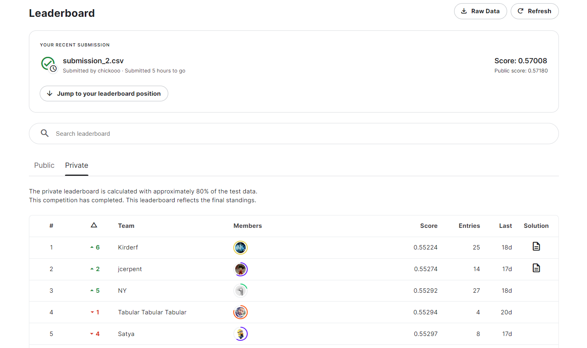

# California Housing Price Competition
 
<b>Goal:</b> Predict median price of houses in given block of California 
 
 

 
 
<b>Description:</b> 
The target variable is the median house value for California districts, expressed in hundreds of thousands of dollars ($100,000). 
 
This dataset was derived from the 1990 U.S. census, using one row per census block group. A block group is the smallest geographical unit for which the U.S. Census Bureau publishes sample data (a block group typically has a population of 600 to 3,000 people). 
 
An household is a group of people residing within a home. Since the average number of rooms and bedrooms in this dataset are provided per household, these columns may take surpinsingly large values for block groups with few households and many empty houses, such as vacation resorts. 
 
<b>Evaluation metrics:</b> Root Mean Squared Error (RMSE)
 
 
 

## Results:
 
<b>Final model:</b> Stacked ensemble of 2 bagging & 3 boosting algorithms
 
<b>Achieved score:</b> 0.570
 
<b>Top score:</b> 0.552
 
<b>Time period:</b> 5 days
 
 

